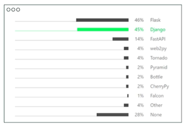
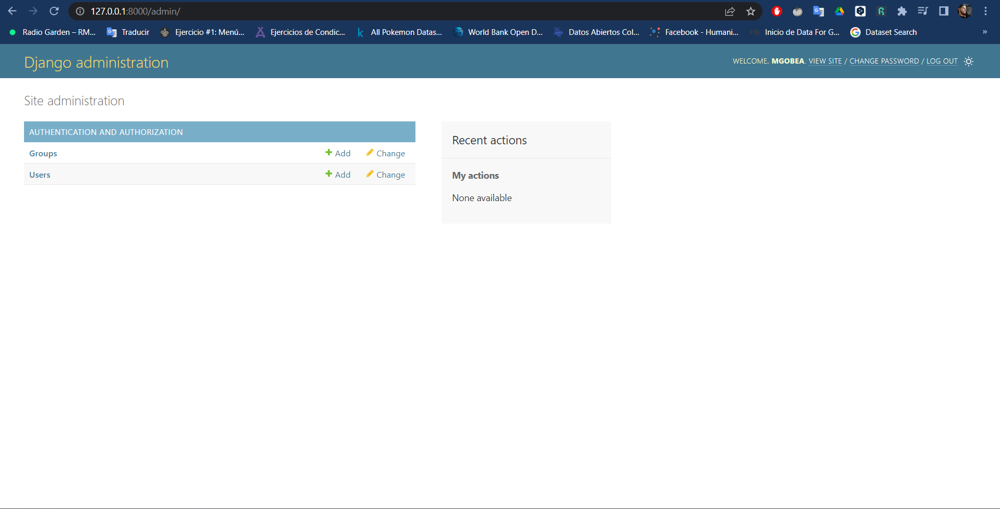
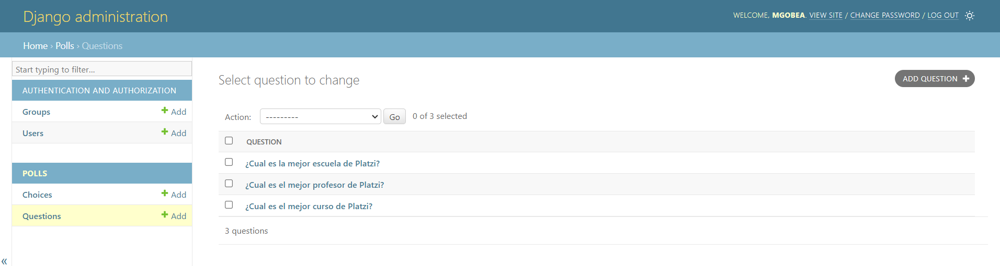

# Django-Python

## ¿Qué es Django?

**Django** es uno de los framework gratis y open source más populares para crear aplicaciones web. Es muy veloz, seguro y escalable.
Es el segundo framework de desarrollo web más usado, siendo **Flask** el más usado solo por un 1% y el tercero siendo **FastAPI**.

Ranking de framework python para desarrollo web: 



Algunos proyectos que usan Django son:

- Instagram
- Pinterest
- National Geographic
- Platzi

------------------------------------------------

## ¿¿¿Flask, Django o FastApi???

Si existe un lenguaje más que versátil para construir el motor de tu siguiente aplicación, ese es Python.

El backend es la sección de una aplicación móvil o web, donde sucede la **lógica de negocio**. Y la lógica de negocio, no es nada más ni nada menos que **la resolución del problema que intenta abordar esa aplicación.**

Para lograr este heroico cometido, se crearon los famosos y tan populares frameworks de desarrollo web. Hay decenas. Seguramente me equivoco, deben haber cientos de ellos. Uno para cada lenguaje, para cada gusto, para cada personalidad o estilo de trabajo incluso.

Aquí no vinimos a verlos a todos, solo a los más importantes, y en Python, solo tres ocupan este podio: Django, Flask y FastAPI.

Con los tres se pueden crear las mismas cosas. Son igual de válidos. Pero sí es cierto que cada uno tiene sus puntos fuertes, como también sus puntos débiles. Conozcamoslos uno a uno.

- El tanque: Django

Django es un framework robusto y cargado. Esas dos palabras lo definen perfectamente. Con una documentación de más de 3000 páginas te llevará de la mano a crear la aplicación web de tus sueños.

¿Qué lo hace sumamente especial y diferente al resto? Tiene el mejor sistema de control y manejo de datos que puedas encontrar en el ecosistema de Python.

Cuenta con un administrador ya programado de base extremadamente potente. Serás capaz de realizar las tareas más comunes en tu base de datos, como crear, borrar, actualizar y leer registros de tus tablas. Y esto se traduce, en la práctica, en poder dar de alta a un usuario y modificar su información rápidamente, si es que tu aplicación posee un sistema de login. O, también, por ejemplo, eliminar rápidamente una película de tu plataforma por errores en la subida, si es que estás construyendo el próximo Netflix.

Django cuenta con un 45% de acogida entre todos los desarrolladores web que trabajan con el lenguaje de la serpiente.
Y, con compañías como Instagram y Platzi usándolo todos los días, es una gran elección para comenzar.

- El heroe: Flask

5 años más jóven que Django, y nacido para destronar al rey. ¿Tienes una idea en mente, pero no quieres pasar por todo el proceso de configuración y establecimiento del entorno que tiene Django? Flask es tu elección. ¿Te interesa usar una base de datos no relacional en tu app? Django te lo permite… pero permíteme desaconsejarte hacer eso. ¿Por qué? Porque Flask permite realizar una conexión mucho más sencilla y con menos pasos a estos novedosos almacenes de datos.

Con un 46% de uso entre todos los desarrolladores web con Python, y con empresas como Netflix y Reddit apoyándose en este proyecto durante cada jornada para hacer vivir sus aplicaciones, es también una gran decisión empezar por Flask.

- La jóven promesa: FastAPI

Con solo tres años de edad, al día de publicación de este blogspot, FastAPI promete convertirse en el framework definitivo para la nueva generación de aplicaciones web que ya están naciendo.

Veloz. Solo esa palabra lo define. Es (y no solo en Python, sino hablando en comparación a todos los otros lenguajes de programación) una de las herramientas más veloces para construir un backend, peleando mano a mano con bestias de la velocidad como Go o Node.js.

¿Quieres hacer menos de 10 líneas de código Python y tener un backend 100% funcional, corriendo en tu computadora? FastAPI. ¿Quieres crear tu primera API (Application Program Interface) para conectar todos los componentes de tu aplicación? FastAPI. Pero, sobre todo… ¿Te interesa que tu aplicación sea una de las más veloces del mercado, y que tus usuarios no paren de admirar los milisegundos que tarda en cargarse la primera página de tu proyecto? FastAPI.

Con un 14% de uso entre todos los desarrolladores web con Python, utilizado por Netflix, Uber, y empresas tan grandes como Microsoft, en Platzi hoy le apostamos a FastAPI.

Creemos fielmente que iniciar tu camino como cinturón negro en Python de la mano de este framework es la mejor ruta para convertirte en un profesional del desarrollo backend. 

-------------------------------------------------

## Instalación de Django

1. Con el entorno virtual creado y activo, nuestro repo activo y enlazado, el gitignore armado corremos: 

```bash
pip install django
```

2. Inicializo mi proyecto django con el siguiente comando: 

```bash
django-admin startproject premiosplatziapp
```
Este comando va a armar toda una estructura para nuestro proyecto con el nombre que le hemos asignado dentro de la carpeta donde estemos trabajando. 

---------------------------------------------

## Explorando los archivos que creó Django

- manage.py

Nos muestra a nosotros, owners del proyecto diferentes comandos que tenemos a disposición para hacer que el proyecto funcione. 

- premiosplatziapp/__init__.py

Archivo clasico de python que nos indica que una carpeta es un paquete

- premiosplatziapp/asgy.py & premiosplatziapp/wsgi.py

Archivo de django que nos permite hacer el deploy de una aplicación

Nos quedan los dos que son los mas importantes y que vamos a modificar mucho mientras estemos desarrollando el proyecto: 

- **premiosplatziapp/settings.py**

Contiene toda la información sobre la configuración de nuestro proyecto

- **premiosplatziapp/urls.py**

Contiene todas las URL por las que va a funcionar nuestro proyecto. 

--------------------------------------------

## El servidor de desarrollo

Cuando trabajamos desarrollando servidores web en backend contamos con dos servidores distintos. Uno local, que vive en localhost y sobre el cual trabajamos las ediciones y correciones necesarias y uno de producción que es el que vive en la web y sobre el cual no hacemos ediciones nunca. Si hay algo para corregir lo corregimos en local y luego volvemos a deployar el proyecto. 

Django nos permite trabajar con un servidor de desarrollo que nos facilita el trabajo y nos permite ver en tiempo real los cambios que hacemos en nuestro codigo. ¿Como lo usamos? 

1. Encendemos el servidor de desarrollo: 

```bash
python3 manage.py runserver
```
ó

```bash
py manage.py runserver
```

Nos dirigimos a http://127.0.0.1:8000/ y podremos ver nuestro servidor de desarrollo ya construido y funcionando aún sin contenido. Pero listo para que lo editemos. 

Al iniciar nuestro servidor Django va a crear una base de datos sqlite3 dentro del proyecto para poder almacenar allí los datos que correspondan. 

**IMPORTANTE**: La variable DEBUG en el archivo setting.py debe ser TRUE mientras estemos trabajando en modo desarrollo pero en cuanto llevemos nuestro proyecto a producción debemos asegurarnos antes que DEBUG pase a FALSE.

--------------------------------------

## Iniciando el proyecto Premios Platzi App

Algunas cosas que tenemos que saber antes de empezar en django: 

- Proyectos: conjuntos de aplicaciones. Instagram por ej es un proyecto formado por varias aplicaciones. 
- Aplicaciones. Ejemplo de aplicaciones de instagram: "feed", "stories", "messages", etc. 

Premios platzi app va a ser nuestro proyecto y dentro de ella vamos a construir distintas aplicaciones: "polls"

Trabajar con aplicaciones nos sirve para poder modularizar o componentizar nuestras aplicaciones, para poder trasladarlas de un proyecto a otro de forma muy simple. 

1. Dicho lo anterior, el comando inicial de django lo usamos para crear un proyecto pero ahroa debemos crear nuestra primer aplicación. La misma se debe crear dentro de la carpeta del proyecto que iniciamos anteriormente así: 

```bash
py manage.py startapp polls
```
Esto creo un paquete/carpeta "polls" dentro de la carpeta raiz de nuestro proyecto con una estructura de archivos que ya vamos a ir viendo en el transcurso de este proyecto. 

Ahora solo vamos a trabajar sobre el archivo views.py para crear un hola mundo. 

1. premiosplatziapp\premiosplatziapp\urls.py

```py
from django.contrib import admin
from django.urls import path, include

urlpatterns = [
    path('admin/', admin.site.urls),
    path('polls/', include("polls.urls")) # Importo todos los paths de la app "polls"
]
```

2. premiosplatziapp\polls\views.py

```py
from django.shortcuts import render
from django.http import HttpResponse

# Create your views here.

def index(request):
    return HttpResponse("Hello World")
```

3. Creo un archivo dentro del paquete "polls" llamado urls.py que voy a dejar así: 

```py
from django.urls import path

from . import views

urlpatterns = [
    path("", views.index, name="index")
]
```

-------------------------------------------

## Ajustando el archivo settings.py

- premiosplatziapp/premiosplatziapp/settings.py

1. **DATABASES**: 

```py
# Database. Acá podremos configurar con que base de datos vamos a trabajar. Por default Django trabaja con sqllite3
# https://docs.djangoproject.com/en/4.2/ref/settings/#databases

DATABASES = {
    'default': {
        'ENGINE': 'django.db.backends.sqlite3', # Variantes: mysql, postgresql, oracle, etc. Todas relacionales.
        'NAME': BASE_DIR / 'db.sqlite3',
        # 'USER'
        # 'PASSWORD'
    }
}
```

2. **TIME_ZONE**: 

```py
TIME_ZONE = 'America/Argentina/Buenos_Aires' # Definimos el timezone de nuestro proyecto. Para el caso de Arg sería UTC-3 pero se debe colocar con el codigo de timezone de arriba.

# De acá debemos sacar el timezone para el proyecto. Segunda columna: https://en.wikipedia.org/wiki/List_of_tz_database_time_zones
```

3. **INSTALLED_APPS**: Django ya cuenta con una serie de apps que por default le asigna a todos los proyectos: admin, auth, contenttypes, sessions, messages, staticfiles. A este deberíamos sumarle la app que ya creamos "polls"

```py
## Apps que trae Django por default.
INSTALLED_APPS = [
    'django.contrib.admin',
    'django.contrib.auth',
    'django.contrib.contenttypes',
    'django.contrib.sessions',
    'django.contrib.messages',
    'django.contrib.staticfiles',
]
```

----------------------------------------

## ¿Que es ORM? ¿Que es un modelo? 

**ORM = Object Relational Mapping** nos explica como yo puedo relacionar, por un lado la estructura de una b**ase de datos relacional** (RDB) con, por el otro, la **programación orientada a objetos**

Ciertas librerías y frameworks me permiten replicar la estructura de una RBD con POO. Una de ellas es Django. 

En RDB cada entidad se corresponde en una tabla. 
En POO cada entidad se corresponde con un archivo.py

Ese archivo se va a llamar **model y se crea con clases de POO**

Cada tabla tiene columnas con atributos de mi entidad, pensemos en users: PK, username, password, fecha de creación, etc. Las columnas al trabajar con un ORM se corresponden con los atributos de nuestras clases. Cada una de las columnas también se define en RDB con un tipo de datos, al igual en nuestra clase también definiremos a cada uno de los atributos con un tipo de dato que son clases también a su vez. 

-------------------------------------------

## Creando un diagrama entidad-relación para nuestro proyecto

- app polls (dos tablas):

    - Questions (columnas/atributos): 
        - id: int (Primary Key - PK)
        - question_text: varchar
        - pub_date: datetime
    - Choices (columnas/atributos):
        - id: int (Primary Key - PK)
        - question: int (Llave foranea o foreign key -FK- que relaciona con el question id)
        - choice_text: varchar
        - votes: int

    Questions se relaciona con Choices de forma 1 a muchas.

----------------------------------------------

# Creando los modelos Question y Choice en codigo: 

Vamos a crear nuestras tablas diseñadas arriba en el diagram entidad-relación pero con el ORM de Django. 

1. Será en el archivo models.py de nuestra app polls donde trabajaremos todos lo relacionado a datos de nuestra aplicación. 

```py
from django.db import models

# Create your models here.

# Django transformara nuestras clases a tablas en nuestra base de datos sqlite3
class Question(models.Model):
    # Definimos los atributos de esta clase que se corresponden con las columnas de la tabla Question: 
    # id no es necesario dado que Django lo genera solo de forma autoincremental
    question_text = models.CharField(max_length=200)
    pub_date = models.DateTimeField(name="date published")

# Segundo modelo Choices
class Choices(models.Model):
    # id
    question = models.ForeignKey(Question, on_delete=models.CASCADE) # Llave foranea que establece la relación 1 - muchos entre mis models
    # El on_delete=models.CASCADE establece que si se borra una Question se deben borrar todas las choices de esa question
    choice_text = models.CharField(max_length=200)
    votes = models.IntegerField(default=0)
```

2. Establezco en settings.py que la app que estamos construyendo es parte del proyecto así: 

```py
INSTALLED_APPS = [
    # Apps propias
    'polls.apps.PollsConfig',
    # Apps de Django
    'django.contrib.admin',
    'django.contrib.auth',
    'django.contrib.contenttypes',
    'django.contrib.sessions',
    'django.contrib.messages',
    'django.contrib.staticfiles',
    # Apps de terceros si hubieses
]
```

3. Creo dentro de polls/migrations el archivo con la estructura que tiene que tener nuestra base de datos con el siguiente comando en la raiz del proyecto: 

```bash
21:41:23 👽 with 🤖 mgobea 🐶 in python/django_python/premiosplatziapp via django_python …
➜ python3 manage.py makemigrations polls
Migrations for 'polls':
  polls/migrations/0001_initial.py
    - Create model Question
    - Create model Choices
```
4. Ejecuto el ORM de Django para crear en mi base de datos sqlite3 mis tablas. Una por cada modelo. Esto lo hago con el siguiente comando también desde la raiz del proyecto: 

```bash
21:42:05 👽 with 🤖 mgobea 🐶 in python/django_python/premiosplatziapp via django_python …
➜ python3 manage.py migrate
Operations to perform:
  Apply all migrations: admin, auth, contenttypes, polls, sessions
Running migrations:
  Applying contenttypes.0001_initial... OK
  Applying auth.0001_initial... OK
  Applying admin.0001_initial... OK
  Applying admin.0002_logentry_remove_auto_add... OK
  Applying admin.0003_logentry_add_action_flag_choices... OK
  Applying contenttypes.0002_remove_content_type_name... OK
  Applying auth.0002_alter_permission_name_max_length... OK
  Applying auth.0003_alter_user_email_max_length... OK
  Applying auth.0004_alter_user_username_opts... OK
  Applying auth.0005_alter_user_last_login_null... OK
  Applying auth.0006_require_contenttypes_0002... OK
  Applying auth.0007_alter_validators_add_error_messages... OK
  Applying auth.0008_alter_user_username_max_length... OK
  Applying auth.0009_alter_user_last_name_max_length... OK
  Applying auth.0010_alter_group_name_max_length... OK
  Applying auth.0011_update_proxy_permissions... OK
  Applying auth.0012_alter_user_first_name_max_length... OK
  Applying polls.0001_initial... OK
  Applying sessions.0001_initial... OK
```

Listo! Ya tenemos los modelos creados en models.py y también las bases de datos creadas en sqlite3!!!

-----------------------------------

## La consola interactiva de Django

Introducción: Python tiene una consola interactiva a la cual accedemos con python3 nuestra bash. 

- Consola Python: 

```py
21:52:25 👽 with 🤖 mgobea 🐶 in develop/python/django_python via django_python …
➜ python3
Python 3.10.6 (main, Mar 10 2023, 10:55:28) [GCC 11.3.0] on linux
Type "help", "copyright", "credits" or "license" for more information.
>>> print("hola mundo")
hola mundo
>>> numero_1 = 5
>>> numero_2 = 10
>>> numero_1 + numero_2
15
```

- Consola Django: nos posibilita interactuar con nuestros archivos. 

1. Para entrar correr en bash: 

```bash
python3 manage.py shell
```
Es importante que estés ubicado en la raiz de un proyecto Django para que funcione

2. Al abrir se va a ver casi igual que la consola de python, pero va a decir abajo entre parentesis (InteractiveConsole) que nos va a dar acceso al proyecto...

IMPORTANTE: Si modificamos el archivo models.py es necesario que volvamos a correr los dos comandos para que el ORM modifique nuestras tablas: 

```bash
python3 manage.py makemigrations polls

python3 manage.py migrate
```

Ahora si al entrar a la interactive console de Django vamos a poder importar las clases de nuestro modelo y usar el atributo objects.all() que nos permite traer todos los objetos que se crearon de nuestra clase: 

```bash
22:09:33 👽 with 🤖 mgobea 🐶 in python/django_python/premiosplatziapp via django_python …
➜ python3 manage.py shell
Python 3.10.6 (main, Mar 10 2023, 10:55:28) [GCC 11.3.0] on linux
Type "help", "copyright", "credits" or "license" for more information.
(InteractiveConsole)
>>> from polls.models import Choice, Question
>>> Question.objects.all()
<QuerySet []>
>>> Choice.objects.all()
<QuerySet []>
>>>
```

En el ejemplo de arriba ⬆️ nos retorna un objeto QuerySet vacio dado que por el momento no hemos creado objetos de este tipo... 

Voy a importar de django.utils el modulo timezone para poder usar las clases de horarios con zonas horarias incorporadas y generar objetos dentro de mi consola interactiva de Django... 

```bash
22:25:57 👽 with 🤖 mgobea 🐶 in python/django_python/premiosplatziapp via django_python …
➜ python3 manage.py shell
Python 3.10.6 (main, Mar 10 2023, 10:55:28) [GCC 11.3.0] on linux
Type "help", "copyright", "credits" or "license" for more information.
(InteractiveConsole)
>>> from polls.models import Choice, Question
>>> Question.objects.all()
<QuerySet []>
>>> Choice.objects.all()
<QuerySet []>
>>> from django.utils import timezone
>>> q = Question(question_text="¿Cual es el mejor curso de Platzi?", pub_date=ti
mezone.now())
>>> q.save()
```

En q guarde un objeto de tipo Question() y con q.save() estoy guardano ese objeto en mis bases de datos. 

---------------------------------------

## El metodo __str__

Cuando desde la consola interactiva de Django tenemos objetos creados y queremos conocerlos nos vamos a encontrar que al acceder al listado de objetos vamos a ver el nombre de los mismos pero no vamos a ver las descripciones. 

```bash
>>> q2 = Question(question_text="¿Cual es el mejor profesor de Platzi?", pub_dat
e=timezone.now())
>>> q2
<Question: Question object (None)>
>>> Question.objects.all()
<QuerySet [<Question: Question object (1)>]>
>>> q2.save()
>>> Question.objects.all()
<QuerySet [<Question: Question object (1)>, <Question: Question object (2)>]>
>>> q2.question_text
'¿Cual es el mejor profesor de Platzi?'
>>> q2.pub_date
datetime.datetime(2023, 6, 18, 15, 45, 55, 663639, tzinfo=datetime.timezone.utc)
```

Como vemos el Question.objects.all() no es util para conocer todas nuestras preguntas. Para que lo sea tenemos que sumarle a nuestros modelos el metodo "dunderstring" o __str__ que permitirá retornar las preguntas, su texto en lugar del objeto completo. 

```py
import datetime

from django.db import models
from django.utils import timezone

# Create your models here.

# Django transformara nuestras clases a tablas en nuestra base de datos sqlite3
class Question(models.Model):
    # Definimos los atributos de esta clase que se corresponden con las columnas de la tabla Question: 
    # id no es necesario dado que Django lo genera solo de forma autoincremental
    question_text = models.CharField(max_length=200)
    pub_date = models.DateTimeField(name="pub_date")

    def __str__(self):
        return self.question_text
    
    def was_published_recently(self):
        return self.pub_date >= timezone.now()  - datetime.timedelta(days=1)

# Segundo modelo Choices
class Choice(models.Model):
    # id
    question = models.ForeignKey(Question, on_delete=models.CASCADE) # Llave foranea que establece la relación 1 - muchos entre mis models
    # El on_delete=models.CASCADE establece que si se borra una Question se deben borrar todas las choices de esa question
    choice_text = models.CharField(max_length=200)
    votes = models.IntegerField(default=0)

    def __str__(self):
        return self.choice_text

## Cada vez que haga un cambio en los modelos tengo que ejecutar los dos comandos para activar y trabajar con el ORM
```

Cuando los cambios en el modelo son sobre los metodos y no sobre los atributos no es necesario volver a correr el makemigrations polls y el migrate. 

Ahora al volver a abrir la consola interactiva de Django vamos a poder ver el contenido de nuestras preguntas al usar el metodo de nuestra clase heredada models .objects.all()

```bash
13:02:41 👽 with 🤖 mgobea 🐶 in python/django_python/premiosplatziapp via django_python took 20m 50.3s …
➜ python3 manage.py shell
Python 3.10.6 (main, Mar 10 2023, 10:55:28) [GCC 11.3.0] on linux
Type "help", "copyright", "credits" or "license" for more information.
(InteractiveConsole)
>>> from polls.models import Question, Choice
>>> Question.objects.all()
<QuerySet [<Question: ¿Cual es el mejor curso de Platzi?>, <Question: ¿Cual es el mejor profesor de Platzi?>]>
>>>
```
----------------------------------

## Filtrando los objetos creados desde la consola interactiva:

Tenemos dos metodos especiales que nos brinda Django que nos permitiran hacer busquedas dentro de nuestras tablas. 

1- Question.objects.get(pk=1): En este ejemplo estamos trajendo los elementos de mi QuerySet cuya primary key sea igual a 1 

```bash
>>> Question.objects.all()
<QuerySet [<Question: ¿Cual es el mejor curso de Platzi?>, <Question: ¿Cual es el mejor profesor de Platzi?>, <Question: ¿Cual es la mejor escuela de Platzi?>]>
>>> Question.objects.get(pk=1)
<Question: ¿Cual es el mejor curso de Platzi?>
```

En este caso está trayendo un unico elemento de tipo objeto

Otro ejemplo: Question.objects.get(pub_date__year=2023) con el operador de busqueda de Django __ podemos definir dentro de un datetime que parte del mismo vamos a usar para buscar. En este ejemplo estamos buscando por año: 

```bash
>>> Question.objects.get(pub_date__year=2023)
Traceback (most recent call last):
  File "<console>", line 1, in <module>
  File "/home/mgobea/develop/python/django_python/venv/lib/python3.10/site-packages/django/db/models/manager.py", line 87, in manager_method
    return getattr(self.get_queryset(), name)(*args, **kwargs)
  File "/home/mgobea/develop/python/django_python/venv/lib/python3.10/site-packages/django/db/models/query.py", line 640, in get
    raise self.model.MultipleObjectsReturned(
polls.models.Question.MultipleObjectsReturned: get() returned more than one Question -- it returned 3!
>>> Question.objects.get(pub_date__year=timezone.now().year)
Traceback (most recent call last):
  File "<console>", line 1, in <module>
  File "/home/mgobea/develop/python/django_python/venv/lib/python3.10/site-packages/django/db/models/manager.py", line 87, in manager_method
    return getattr(self.get_queryset(), name)(*args, **kwargs)
  File "/home/mgobea/develop/python/django_python/venv/lib/python3.10/site-packages/django/db/models/query.py", line 640, in get
    raise self.model.MultipleObjectsReturned(
polls.models.Question.MultipleObjectsReturned: get() returned more than one Question -- it returned 3!
```

En realidad el metodo get no nos sirve para esto. Dado que get es un metodo para obtener un UNICO resultado de nuestra consulta y en este aso estariamos obteniendo 3 resultados. Por lo que debemos recurrir a otro metodo de Django llamado "filter"

```bash
>>> Question.objects.filter(pub_date__year=timezone.now().year)
<QuerySet [<Question: ¿Cual es el mejor curso de Platzi?>, <Question: ¿Cual es el mejor profesor de Platzi?>, <Question: ¿Cual es la mejor escuela de Platzi?>]>
```

Podemos ver cuantos tipos de filtros usando el double-underscore "__" existen en la docu oficial de Django en esta sección: 

https://docs.djangoproject.com/en/3.2/topics/db/queries/#field-lookups-intro

------------------------------------------------

## El metodo filter de Django

Para obtener mas de 1 valor en una consulta a nuestra base de datos debemos usar entonces el metodo .objects.filter(parametro de comparación)

En el caso de filter por mas que traiga un solo elemento va a ser un iterable de tipo QuerySet con 1 o mas elementos dentro. 

Algunos ejemplos de uso de **filter**: 

```bash
>>> Question.objects.filter(question_text__startswith="¿Cual")
<QuerySet [<Question: ¿Cual es el mejor curso de Platzi?>, <Question: ¿Cual es el mejor profesor de Platzi?>, <Question: ¿Cual es la mejor escuela de Platzi?>]>
>>> Question.objects.filter(pub_date__year=timezone.now().year)
<QuerySet [<Question: ¿Cual es el mejor curso de Platzi?>, <Question: ¿Cual es el mejor profesor de Platzi?>, <Question: ¿Cual es la mejor escuela de Platzi?>]>
>>> Question.objects.filter(question_text__contains="el mejor")
<QuerySet [<Question: ¿Cual es el mejor curso de Platzi?>, <Question: ¿Cual es el mejor profesor de Platzi?>]>
>>> Question.objects.exclude(question_text__contains="el mejor")
<QuerySet [<Question: ¿Cual es la mejor escuela de Platzi?>]>
```

El ultimo ejemplo en realidad es de uso de **exclude** que es una herramienta de Django para buscar aquellos que no cumplan una condición declarada. 

---------------------------------------------

## Accediendo al conjunto de respuestas

1. ¿Como podría por ejemplo traerme a "q" la primer Question guardada y a la cual ya no puedo acceder por "q" dado que cerré y volví a abrir mi consola intereactiva? 

```bash
>>> q = Question.objects.get(pk=1)
>>> q
<Question: ¿Cual es el mejor curso de Platzi?>
```

2. Si, como en mi caso, Question tiene una relación de "1 a muchas" con Choice, entonces yo puedo acceder a todas las respuestas posibles para una de mis preguntas usando un metodo que viene de mi clase heredada "Model" y que sirve para esto: 

```bash
>>> q.choice_set.all()
<QuerySet []>
```
En este caso mi QuerySet está vacio dado que aún no tengo respuesta para mi pregunta. 

3. Creo mis respuestas a partir de cada una de las preguntas a las que responden esas opciones o choices. Para esto debemos usar el siguiente método también heredado de la clase "Model" de Django: 

```bash
>>> q.choice_set.create(choice_text="Curso Básico de Python", votes=0)
<Choice: Curso Básico de Python>
```

La alternativa hubiese sido crear un objeto choice y asignarle una Foreign Key manualmente así: 

```bash
>>> c2 = Choice(question=q, choice_text="Nuevo Curso de Programación Básica", votes=0)
>>> q.choice_set.all()
<QuerySet [<Choice: Curso Básico de Python>]>
>>> c2.save()
>>> q.choice_set.all()
<QuerySet [<Choice: Curso Básico de Python>, <Choice: Nuevo Curso de Programación Básica>]>
```

Es importante entender que si creamos nuestra choice de esta forma debemos salvar la variable en nuestra tabla con el método "save()" antes de poder consultarla con choice_set.all()

Si luego de tener muchas opciones, en lugar de ver el listado de las mismas nos interesa saber solamente la cantidad de objetos creados de nuestro modelo entonces podemos hacerlo con el siguiente método: **q.choice_set.count()**

```bash
>>> q.choice_set.create(choice_text="Curso Profesinal de Git y Github", votes=0)
<Choice: Curso Profesinal de Git y Github>
>>> q.choice_set.create(choice_text="Curso de Fundamentos de Ingeniería de Software", votes=0)
<Choice: Curso de Fundamentos de Ingeniería de Software>
>>> q.choice_set.create(choice_text="Curso de Terminal de Comandos", votes=0)
<Choice: Curso de Terminal de Comandos>
>>> q.choice_set.all()
<QuerySet [<Choice: Curso Básico de Python>, <Choice: Nuevo Curso de Programación Básica>, <Choice: Curso Profesinal de Git y Github>, <Choice: Curso de Fundamentos de Ingeniería de Software>, <Choice: Curso de Terminal de Comandos>]>
>>> q.choice_set.count()
5
```
Basicamente, estos métodos nos permite evitarnos que tengamos que consultar todo esto a traves de sqlite3 con SQL sintax. Lo cual también sería posible. Ejemplo: 

```bash
17:10:07 👽 with 🤖 mgobea 🐶 in python/django_python/premiosplatziapp via django_python sqlite3 db.sqlite3
SQLite version 3.37.2 2022-01-06 13:25:41
Enter ".help" for usage hints.

sqlite> .databases
main: /home/mgobea/develop/python/django_python/premiosplatziapp/db.sqlite3 r/w

sqlite> .tables
auth_group                  django_admin_log
auth_group_permissions      django_content_type
auth_permission             django_migrations
auth_user                   django_session
auth_user_groups            polls_choice
auth_user_user_permissions  polls_question

sqlite> SELECT * FROM polls_question;
1|¿Cual es el mejor curso de Platzi?|2023-06-18 01:28:11.363189
2|¿Cual es el mejor profesor de Platzi?|2023-06-18 15:45:55.663639
3|¿Cual es la mejor escuela de Platzi?|2023-06-18 16:11:10.714535

sqlite> SELECT * FROM polls_choice;
1|Curso Básico de Python|0|1
2|Nuevo Curso de Programación Básica|0|1
3|Curso Profesinal de Git y Github|0|1
4|Curso de Fundamentos de Ingeniería de Software|0|1
5|Curso de Terminal de Comandos|0|1
```
---------------------------------------

## El administrador de Django: 

Django posee un administrador de datos único en comparación con Flask y FastApi que lo hacen muy potente en el mercado. 

1. Primero debemos crear por consola un superuser: 

```bash
17:20:23 👽 with 🤖 mgobea 🐶 in python/django_python/premiosplatziapp via django_python …
➜ python3 manage.py createsuperuser
Username (leave blank to use '######'):
Email address: ############@gmail.com
Password:
Password (again):
Superuser created successfully.
```
Este comando es muy importante no compartir su contenido con nadie dado que cualquier persona con acceso a este superuser podría tirar abajo un proyecto Django.

2. Ahora con este user puedo acceder al endpoint de mi proyecto que teniamos desde el principio y se llamaba "/admin" accediendo a:

http://127.0.0.1:8000/admin

3. Me logueo allí con las credenciales creadas en el paso 1. 



Listo! Puedo acceder al front de admin de mi proyecto para crear grupos y usuarios y asignarle permisos en especifico.

4. Ojo! Para que el admin pueda acceder también a nuestros modelos debemos declarar los mismos en el archivo admin.py de cada app. En este caso estamos hablando de la única app que tenemos creada por el momento que es "polls"

```py
from django.contrib import admin
from .models import Question, Choice

# Register your models here.

admin.site.register([Question, Choice])
```
Y ahora sí podremos desde el admin ver y administrar los objetos de nuestro modelo



---------------------------

## ¿Que son las views o vistas? 

Las vistas son las interfaces HTML que mostramos a nuestros usuarios cuando ellos acceden a alguno de nuestros endpoints para interactuar con nuestra Web App. 

Django utiliza una arquitectura de trabajo que se conoce como **"Model Template View" o "MTV"**. 

En Django voy a trabajar: 

1. Creando Modelos
2. Esos Modelos los voy a mostrar en un Template
3. Y estas Templates van a funcionar a raiz de determinadas Views.

Recordemos un poco entonces: 

- ¿Cual es el objetivo de Django? 

Crear aplicaciones web o Web App´s al igual que Flask por ejemplo. 

- ¿Como está compuesta una aplicación web? 

Se compone de dos partes fundamentales:
    1. Un frontend (HTML, CSS y JavaScript)
    2. Un backend (Django, Flask y FastAPI)

Ahora bien, Django (y Flask también) es un framework tan potente que nos permite trabajar el backend de nuestra aplicación web pero también el frontend de nuestra aplicación web. 

Django Web App: un backend y un frontend que va a funcionar ambos a raiz de Django.

Sin embargo existe algo aún mas avanzado que es Django Rest Framework que es un aplicativo de Django que nos permite desarrollar solamente el backedn y el Frontend si se lo dejamos ya a otros equipos. 

El backend en Django se va a escribir en "**views**" y el frontend se va a escribir en "**templates**" 

Una **view** es una pagina web que tiene una funcionalidad (que va a ser su backend) y una cara visible (que va a ser su frontend). El ultimo se expresa como templates. 

Una view puede ser una función o puede ser una clase. Cualquier de los dos opciones son validas: 
1. Function Based Views (View basada en funciones)
2. Generic Views (View basada en clases)

Cada vez que yo construyo una pagina tengo que pensar que voy a necesitar una view para esa pagina.

------------------------------------------

## Creando vistas para la aplicación

1. Para crear views, como suena lógico, el primer paso es dirigirse al archivo de nuestra app llamado **views.py**

2. Las vistas o views siempre deben recibir un objeto de django request como parametro. Dado que el acceso a una pagina web no es mas que el resultado de una request o pedido de un cliente para acceder a determinada información. 

```py
from django.shortcuts import render
from django.http import HttpResponse

# Create your views here.

## 1° Function Base View creada en esta app
def index(request):
    return HttpResponse("Estás en la página principal de Premios Platzi App")

## 2° View: Nos muestra una pregunta y el detalle de las opciones de respuesta para esa pregunta
def detail(request, question_id):
    return HttpResponse(f"Estás viendo la pregunta número {question_id}")

## 3° View: Cantidad de votos que tiene cada una de las respuestas de nuestras preguntas
def results(request, question_id):
    return HttpResponse(f"Estás viendo los resultados de la pregunta número {question_id}")

## 4° View: La vamos a usar para votar pero no va a tener un frontend propio.
def vote(request, question_id):
    return HttpResponse(f"Estas votando a la pregunta número {question_id}")
```

3. Modificamos el archivos urls.py de nuestra app para incorporar las nuevas rutas que hemos creado como views: 

```py
from django.urls import path

from . import views

urlpatterns = [
    path("", views.index, name="index"),
    path("<int:question_id>/", views.detail, name="detail"),
    path("<int:question_id>/results/", views.results, name="results"),
    path("<int:question_id>/vote/", views.vote, name="vote"),
]
```
Con "<int:question_id>" podemos pasar a traves de nuestra URL parametros variables en Django.

Listo! ya podemos probar nuestras views en un navegador. Por supuesto que por el momento son solo texto dado que no tienen un template asociado aún. 

-----------------------------------

## Templates de Django. 

Cada vista se puede ligar a un template en particular. Cada view sería el backend y cada template sería el frontend siempre que nos estemos ocupando de construir una app de forma fullstack. 

1. Creamos dentro de nuestra app una carpeta llamada templates y dentro de la misma otra llamada polls (es decir como se llama nuestra app)

2. Creamos dentro del directorio anterior un archivo .html por cada view que tenemos en nuestra app. 

3. Django cuenta con un "lenguaje de programación" llamado "Django Template System" que nos ayuda a construir templates. El cual se usa con los simbolos de . Es decir, ej Jinja. Para poder escribir rapidamente en Jinja podemos usar la extensión de Jinja que instalamos para trabajar con Flask o podemos instalar la extensión de Django que es aún mas agil. 

4. Si instalamos la extensiones de Django debemos hacer una config adicional en nuestro archivo settings.json de VSCode para que en un mismo archivo podamos invocar las estructuras rapidas de Django así como las estructuras de HTML para tener una sintaxis mas rapida y productiva. La misma se configura agregando en el archivo mencionado el siguiente JSON: 

```json
    "emmet.includeLanguages": {
        "html": "django-html"
    }
```
Probablemente debas recargar la extensión de Django nuevamente luego de esta config para que todo funcione bien. 

5. Construimos nuestro primer template para index.html dentro de la app "polls" así por ejemplo: 

```html

    <ul>
        
            <li><a href="/polls/{{ question.id }}">{{ question.question_text }}</a></li>
        
    </ul>

    <p>No polls are available</p>

```

6. Para que el template funcione y quede asociado a nuestra view debemos editar nuestra view de index en views.py: 

```py
from django.shortcuts import render
from django.http import HttpResponse
from .models import Question

# Create your views here.

## 1° Function Base View creada en esta app
def index(request):
    latest_question_list = Question.objects.all() # Traigo todos los objetos pregunta de mi app para renderearlos en mi Template
    context = {
        "latest_question_list": latest_question_list
    }
    return render(request, "polls/index.html", context) # No es necesario pasar el dict de context expandido como en Flask en Django
```

Hecho esto ya podemos visitar nuestro endpoint "/polls" y ver a nuestro primer template en funcionamiento. 

-------------------------------------

## Elevando el error 404

Recordemos que los errores en el rango de los 400 son errores del lado del cliente. Mientras que los errores del rango de los 500 son errores del lado del servidor. 

Los errores del lado del cliente deben ser previstos y trabajados de forma oportuna para que la experiencia frente al error sea lo mas grata posible y no consista simplemente en una pantalla estandar del navegador por un error 404. 

Veamoslo aplicado a nuestro endpoint de "detail":

```py
def detail(request, question_id):
    # question = Question.objects.get(pk=question_id) # Busco solo la question_id que me piden por URL. Si la pregunta no existe vamos a tener un 404 a menos que lo manejemos...
    question = get_object_or_404(Question, pk=question_id) # Forma segura para buscar un elemento en el modelo
    context = {
        "question": question
    }
    return render(request, "polls/detail.html", context)
```

Django nos ofrece una forma muy sencilla de manejar el error que es importando el shortcut "get_object_or_404". 

Re definida nuestra view debemos entonces construir el template que vamos a renderear cuando el cliente le pegue a nuestro endpoint:

```html
<h1>{{ question.question_text }}</h1>
<ul>
    
        <li>{{ choice.choice_text }}</li>
    
</ul>
```

Listo ya tenemos renderada la segunda de nuestras views definidas. Aún falta el formato pero eso es algo que vamos a ver luego!!! 

--------------------------------------

## Utilizando la etiqueta url para evitar el hard coding

Buena práctica: Nunca deberiamos hardcodear un valor. Y sin embargo en index.html lo estamos haciendo con la dirección del endpoint al que redirige nuestro list element. 

¿Cual sería el problema? Que sin en urls.py yo cambio la url de acceso a mi app, algo que tranquilamente podría ocurrir en un proyecto profesional, mis templates ya no van a cargar dado que están estructurados con el hardcodeo del endpoint de mi app. 

Así como es un problema tener hardcodeado el nombre de nuestra app también lo es tener hardcodeado el path de nuestros endpoints porque también pueden cambiar. 

Solución: Debo definir una variable de app_name en urls.py de nuestra app y relacionar nuestro archivo de urls.py con nuestro template para poder recurrir a nuestras variables en el mismo lo que logro usando la etiqueta "url" dentro de nuestros templates en lugar de armar la ruta de forma estatica. estos sucede porque Django lee y usa los name de nuestros path y el name de nuestra app para leer los valors de nuestro archivo urls.py

1. Por arriba de nuestro archivo urls.py de la app en la que estamos trabajando debemos agregar: 

- polls/urls.py

```py
from django.urls import path

from . import views

app_name = "polls" # Variable para evitar el hardcodeo en mi template

urlpatterns = [
    path("", views.index, name="index"),
    path("<int:question_id>/", views.detail, name="detail"),
    path("<int:question_id>/results/", views.results, name="results"),
    path("<int:question_id>/vote/", views.vote, name="vote"),
]
```

- index.html

```html

    <ul>
        
            <!-- Usando url de Django para evitar el hardcodeo -->
            <li><a href="{ url 'polls:detail' question.id }">{{ question.question_text }}</a></li>
        
    </ul>

    <p>No polls are available</p>

```

---------------------------------------

## Formularios: lo básico

Concepto fundamental para un backend developer con Python. 

Medio mediante el cual el cliente completa información que nosotros necesitamos para poder utilizar y aplicar la lógica de negocio apropiada (guardar info, procesarla y devolver algo, etc). 

Vamos a transformar nuestra vista de detalle de cada Question en un formulario donde cada cliente podrá darle click y votar que respuesta es la mas apropiada para el. 

HTML tienen un objeto "form" el cual tiene un atributo action="" donde definimos hacía donde queremos enviar la información que se introduce en nuestro formulario. 

¿Donde vamos a enviar el resultado del formulario que estamos creando? A la vista "vote" que es la vista que en principio habiamos definido como una vista sin template especifico. Y ahora se comprende por qué. 

Recordemos también completar el metodo HTTP que va a usar nuestro formulario. En este caso es el método "POST". 

```html
<form action="" method="post">
     <!-- Protección de Django contra el cross site request forgery -->
    <fieldset>
        <legend><h1>{{ question.question_text }}</h1></legend>
        
            <p><strong>{{ error_messege }}</strong></p>
        
        
            <input 
                type="radio"
                name="choice"
                id="choice{{ forloop.counter }}" 
                value="{{choice.id}}"
            >
            <label for="choice{{ forloop.counter }}">
                {{ choice.choice_text }}
            </label> 
            <br>
            <!-- forloop.counter es un atajo de Django para acceder al numero de vueltas que lleva nuestro ciclo. Nos permite tener un id dinamico -->
        
    </fieldset>
    <input type="submit" value="Votar">
</form>

<!-- <h1>{{ question.question_text }}</h1>
<ul>
    
        <li>{{ choice.choice_text }}</li>
    
</ul> -->
```

Con esto ya podemos ver que tenemos nuestro form desplegado pero seleccionemos la opción que seleccionemos no estamos sumando votos realmente dado que para eso debemos trabajar nuestra view de "vote". Cosa que vamos a hacer en la siguiente etapa. 

---------------------------------------------

## Creando la vista vote

- polls/views.py

```py
## 4° View: La vamos a usar para votar pero no va a tener un frontend propio.
def vote(request, question_id):
    question = get_object_or_404(Question, pk=question_id)
    try:
        selected_choice = question.choice_set.get(pk=request.POST["choice"]) # Con el name choice accedo al value choice.id de la elección del cliente. 
    except (KeyError, Choice.DoesNotExist): # Si llave del dict "choice" no existe...No seleccionó nada
        context= {
            "question": question,
            "error_messege": "No elegiste una respuesta"
        }
        return render(request, "polls/detail.html", context)
    else: # Dentro de un try/except se ejecuta si todo salío bien en el Try
        selected_choice.votes += 1 # Sumo un voto al atributo de Choice
        selected_choice.save() # Salvo los nuevos valores en mi base de datos para luego poder recuperarlos
        return HttpResponseRedirect(reverse("polls:results"), args=(question.id))
```

¿Que estamos haciendo en esta vista? 

1. El question_id ya me viene por URL, el mismo viene seleccionado desde la selección que el cliente hace de la pregunta en la que quiere votar en index.html

2. Al hacer submit, el cliente envía el form al endpoint/vista de arriba ⬆️ y podemos acceder al mismo a traves del atributo POST de la variable request. Dentro de la misma que es un diccionario vamos a buscar el "name" del atributo del form que en este caso lo definimos como "choice" y nos va a devolver el "value" correspondiente que según el template que hicimos mas arriba va a ser el "choice.id" 

3. El bloque except lo usamos para evitar que el usuario nos envíe el form sin haber seleccionado ninguna opción. 

4. El bloque else va a definir la lógica de negocio que debe realizar la view en caso de que obtenga la "choice" escogida por el cliente. La cual consiste en sumar un "votes" a su atributo de igual nombre y luego guardar los cambios en nuestra base de datos sqlite3 con el comando .save(). 

5. Finalmente vamos a redirigir al cliente a una pagina luego de envíar el formulario lo cual es una buena práctica a la hora de trabajar con formularios. Es decir, luego del submit no deberíamos seguir en la misma view. Eso lo hacemos con el HttpResponseRedirect que importamos desde django.http. Este redireccionamiento va a ocurrir a una dirección que para no hardcodearla vamos a establecerla usando la function "reverse" de django.urls que es el equivalente pythonico de "url" en Jinja o Django Template System

De esta forma vamos a estar registrando los votos de cada respuesta que luego podremos ver pero por el momento podemos consultar a traves de Consola Interactiva de Django así: 

```bash
08:06:24 👽 with 🤖 mgobea 🐶 in python/django_python/premiosplatziapp via django_python took 12h 54m 22.7s …
➜ python3 manage.py shell

Python 3.10.6 (main, Mar 10 2023, 10:55:28) [GCC 11.3.0] on linux
Type "help", "copyright", "credits" or "license" for more information.
(InteractiveConsole)

>>> from polls.models import Question, Choice
>>> Question.objects.all()
<QuerySet [<Question: ¿Cual es el mejor curso de Platzi?>, <Question: ¿Cual es el mejor profesor de Platzi?>, <Question: ¿Cual es la mejor escuela de Platzi?>]>

>>> q1 = Question.objects.get(pk=1)
>>> q1
<Question: ¿Cual es el mejor curso de Platzi?>

>>> q1.choice_set.all()
<QuerySet [<Choice: Curso Básico de Python>, <Choice: Nuevo Curso de Programación Básica>, <Choice: Curso Profesinal de Git y Github>, <Choice: Curso de Fundamentos de Ingeniería de Software>, <Choice: Curso de Terminal de Comandos>]>

>>> for choice in q1.choice_set.all():
...     print(choice.votes)
...
0
0
2
0
1
```

Ahi vemos por ejemplo que mis 5 respuestas tienen en orden la siguiente cantidad de votos: [0,0,2,0,1] siendo la tercera respuesta la opción mas votada por el momento. 

Otra forma de acceder a esta misma info, quizas mas simple es verlo desde los valores de nuestros models en el admin de Django usando las credenciales que definimos mas arriba... A mi me gusta mas la consola pero son elecciones libres de cada developer. 

----------------------------------------------

## Creando la vista Results


